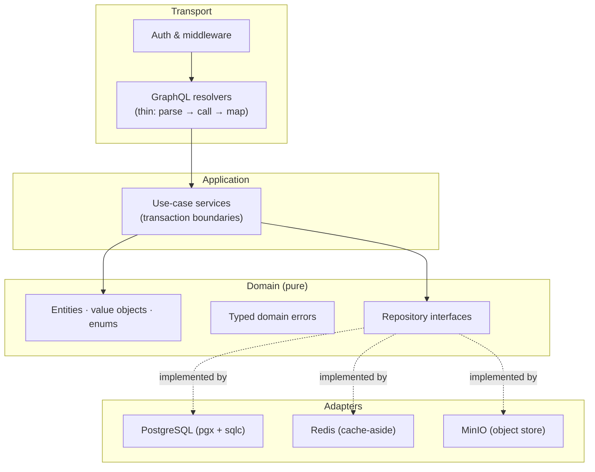
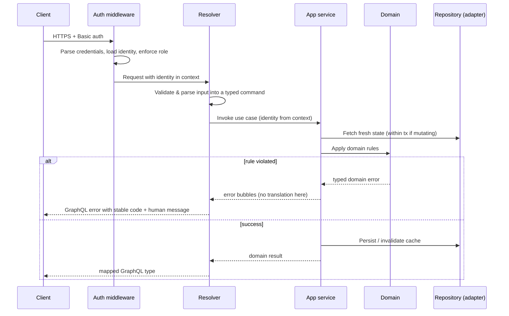
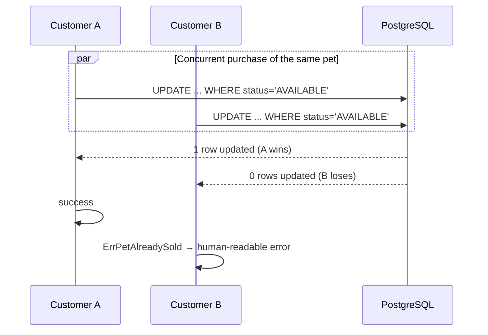

# Architecture

How the backend is structured, how a request flows through it, and how it stays correct under concurrent load. For the data shape see [`DATA_MODEL.md`](DATA_MODEL.md); for security mechanisms see [`SECURITY.md`](SECURITY.md); for the rationale behind specific choices see [`adr/`](adr/).

---

## 1. Design goals

The architecture is shaped by four requirements from the challenge:

1. **Multi-tenant isolation** — a merchant must never reach another store's data.
2. **Race-safety** — two customers must never buy the same pet.
3. **Performance under load** — fast reads for 1k concurrent users via caching and keyset pagination.
4. **Security in depth** — authentication, role separation, and encryption in transit and at rest.

The structure keeps business rules independent of infrastructure so each of these can be reasoned about and tested in isolation.

---

## 2. Layered architecture

Dependencies point **inward**. The domain core has no knowledge of Postgres, Redis, MinIO, or GraphQL. Outer layers depend on inner ones; never the reverse.



| Layer | Responsibility | Must not |
|---|---|---|
| **Transport** (`internal/graph`, `internal/server`, `internal/auth`) | Parse input into typed commands, enforce auth/role, call a service, map the result or translate an error to GraphQL | Contain business rules; touch a repository or `pgxpool` directly |
| **Application** (`internal/app`) | Orchestrate a single use case; own transaction boundaries; decide when to cache/invalidate | Write SQL; build GraphQL types |
| **Domain** (`internal/domain`) | Entities, enums, invariants, typed errors, and the repository **interfaces** it needs | Perform any I/O; import any framework |
| **Adapters** (`internal/adapter`) | Implement the repository interfaces against Postgres / Redis / MinIO | Contain business decisions |

### The dependency rule, concretely

- A repository **interface** is declared by the layer that *uses* it and **implemented** in `adapter/`. Services depend on the interface, never on a concrete adapter.
- `cmd/server/main.go` is the only place that knows every concrete type. It constructs the pool, clients, repositories, and services, and injects them (constructor injection — no globals, no service locator).
- Expensive resources (the `pgxpool`, the Redis client, the MinIO client) are created **once** at startup and reused.

---

## 3. Request lifecycle

A request reads top-to-bottom as a story of well-named steps:



Two invariants visible here:

- **Identity comes from context, never from arguments.** The authenticated merchant's store is derived from the identity, so a client cannot supply a `storeId` to reach another store.
- **Errors are translated only at the resolver.** Services and the domain let typed errors bubble; the resolver is the single place that turns them into a GraphQL error with a stable `code` extension.

---

## 4. Concurrency & race-condition strategy

This is the core correctness requirement. The contended resource is a pet's availability. The source of truth is the `pets.status` column in PostgreSQL; correctness rests on the database, not on application-level coordination.

### 4.1 Single instant purchase

One atomic conditional write decides the winner — there is no read-then-write window:

```sql
UPDATE pets
   SET status = 'SOLD', sold_at = now(), sold_by_customer_id = $customer
 WHERE id = $pet AND status = 'AVAILABLE';
```

- Rows affected = `1` → this caller won the pet.
- Rows affected = `0` → already sold or removed → raise `ErrPetAlreadySold` (or, for idempotency, treat as success if it was already sold to *this same* customer).



### 4.2 Cart checkout (multiple pets, all-or-nothing)

The cart lives on the client; the backend receives `checkout(petIds)`. The whole purchase is one transaction:

1. `SELECT id, name, status, sold_by_customer_id FROM pets WHERE id = ANY($ids) ORDER BY id FOR UPDATE`
   — locking rows in a **deterministic order** (by `id`) prevents deadlocks between overlapping concurrent checkouts.
2. Determine the unavailable set (status ≠ `AVAILABLE`, excluding pets already sold to this same customer).
3. If any are unavailable → **roll back** and raise an error that **names every unavailable pet** (challenge requirement: *"These pets are no longer available: Pluto, Rex."*).
4. Otherwise mark all as sold and commit.

The transaction is atomic: either every pet in the cart is purchased, or none is.

### 4.3 Idempotency

There is no money and a pet has quantity one, so the natural idempotency rule is: a pet **already sold to the requesting customer** counts as a successful purchase, not an error. A retried checkout therefore returns the same outcome without any double effect (rule 16). Removal and creation are likewise expressed as conditional writes that are safe to repeat.

### 4.4 Removal vs. purchase race

Merchant removal is the same conditional-write pattern:

```sql
UPDATE pets SET status = 'REMOVED', removed_at = now()
 WHERE id = $pet AND status = 'AVAILABLE';
```

A pet can only be removed while available, so a removal and a purchase racing for the same pet resolve to exactly one winner at the database.

---

## 5. Caching strategy

Reads dominate (catalog browsing) and must stay fast for 1k concurrent users. The catalog is cached **cache-aside** in Redis:

- The available-pets listing is cached per store and per page (keyed by store + pagination cursor).
- On any state change for a store's pets (create, remove, sell), the store's cached listings are invalidated so a sold pet is never served stale beyond intent.
- The **application service** decides *when* to read-through and *when* to invalidate; the Redis adapter only knows *how* to get/set/delete. Caching policy never leaks into the cache adapter, and persistence never leaks into the service.

PostgreSQL remains the single source of truth; Redis is strictly an accelerator and is always safe to lose.

---

## 6. Pagination

Every list endpoint uses **Relay-style cursor connections** (`edges` / `node` / `pageInfo`) backed by **keyset** pagination ordered by `(created_at, id)`. Offset pagination is avoided because it degrades as the offset grows — keyset pagination stays constant-time with the right index (see [`DATA_MODEL.md`](DATA_MODEL.md#indexes)). Cursors are opaque, encoding the last seen `(created_at, id)`.

---

## 7. Error handling

- Failures are modeled as **typed domain errors** (sentinel values and/or error types), discriminated by callers with `errors.Is` / `errors.As`.
- Errors are **wrapped** with context as they bubble (`%w`), preserving the chain.
- The **resolver** is the single translation point: it maps a domain error to a GraphQL error carrying a stable machine-readable `code` and a human-readable message. Internal details are never leaked to clients.
- See [`API.md`](API.md#error-codes) for the externally-visible error codes.

---

## 8. Configuration & startup (fail-fast)

All configuration is loaded once at startup into a typed struct and validated immediately. A missing **required** value aborts the process with a clear message — the server never boots into a state guaranteed to fail on the first request, and required settings never have silent defaults. See [`SECURITY.md`](SECURITY.md) for how secrets are supplied in Minikube.
