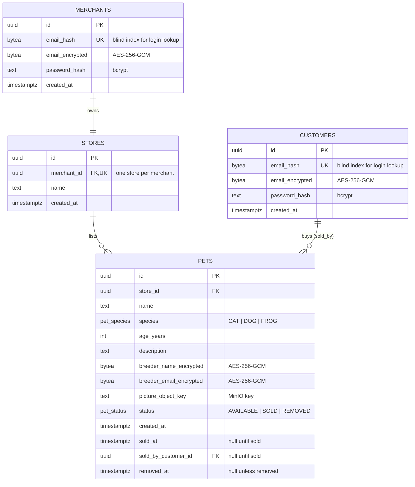
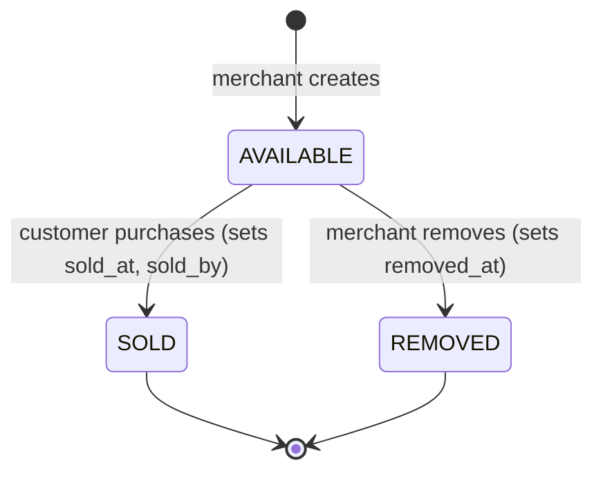

# Data Model

The PostgreSQL schema, the relationships between entities, the indexes that keep reads fast, and what is encrypted at rest. The schema is managed as code with Atlas (see [`adr/0003-sqlc-and-atlas.md`](adr/0003-sqlc-and-atlas.md)) and consumed type-safely by sqlc.

---

## 1. Entity-relationship diagram

---

## 2. Why this shape (scope decisions)

- **One merchant owns one store.** The store is the tenant boundary the challenge names ("each store will have its own separate collection of pets"). It is modeled as a separate table with a unique `merchant_id` so the domain language is explicit and isolation is enforced by a foreign key, not by convention.
- **No `orders`, `order_items`, or `carts` tables.** The challenge describes the cart as a client-side concept ("click add to cart… then click checkout"). The backend only needs `checkout(petIds)`. There is no money, and a pet has quantity one, so an order is fully captured by the purchase facts on the pet row itself. Adding order/cart tables would be speculative scope (rule 15). If a future requirement needs order history grouping, that is the moment to introduce it.
- **Purchase facts live on the pet.** `sold_at` and `sold_by_customer_id` are *historical facts frozen in time*, which is the legitimate exception to "never store derived values": "who bought this pet and when" is a recorded fact, not a value recomputable from elsewhere.

---

## 3. Enumerations

Fixed value-sets are PostgreSQL `ENUM` types so an illegal value is unrepresentable at the database, mirrored by Go typed constants and gqlgen-generated GraphQL enums:

| Enum | Values |
|---|---|
| `pet_species` | `CAT`, `DOG`, `FROG` |
| `pet_status` | `AVAILABLE`, `SOLD`, `REMOVED` |

---

## 4. The `status` column and the single-source-of-truth rule

`pets.status` is the contended resource for purchasing and the synchronization point for race-safety (see [`ARCHITECTURE.md`](ARCHITECTURE.md#4-concurrency--race-condition-strategy)). It is deliberately a stored column rather than a value derived on read, for two reasons:

1. **Concurrency control.** The atomic `UPDATE … WHERE status = 'AVAILABLE'` is what makes a double-sell impossible; it needs a single column to test-and-set.
2. **Read performance.** The hot path — "list available pets" for 1k concurrent users — becomes an index scan over a partial index `WHERE status = 'AVAILABLE'`, rather than an anti-join.

It is not a drift risk: `status` is only ever transitioned inside the same transaction that records the corresponding fact (`sold_at` on sale, `removed_at` on removal), and those transitions are themselves conditional writes. The status and the facts can never disagree.

---

## 5. Lifecycle of a pet

A pet can only leave `AVAILABLE`, and only once — enforced by the conditional `WHERE status = 'AVAILABLE'` on both the purchase and removal writes.

---

## 6. Indexes

| Table | Index | Serves |
|---|---|---|
| `pets` | partial `(store_id, created_at, id)` `WHERE status = 'AVAILABLE'` | Customer catalog browse + merchant "unsold pets", with keyset pagination |
| `pets` | partial `(store_id, sold_at, id)` `WHERE status = 'SOLD'` | Merchant "pets sold within a date range" |
| `pets` | `(store_id)` | Store-scoped access / isolation checks |
| `merchants` | unique `(email_hash)` | Login lookup by blind index |
| `customers` | unique `(email_hash)` | Login lookup by blind index |
| `stores` | unique `(merchant_id)` | Enforces one store per merchant |

Keyset pagination orders by `(created_at, id)` (or `(sold_at, id)` for the sold query), matching the index order so paging stays constant-time regardless of depth.

---

## 7. Encryption at rest

| Column | Protection | Why |
|---|---|---|
| `*.password_hash` | bcrypt (one-way) | Credentials must never be reversible. |
| `merchants.email_encrypted`, `customers.email_encrypted` | AES-256-GCM | Account PII. |
| `*.email_hash` | HMAC-SHA-256 (blind index) | Enables exact-match login lookup without storing or indexing plaintext email. |
| `pets.breeder_name_encrypted`, `pets.breeder_email_encrypted` | AES-256-GCM | Breeder PII, returned only to the owning merchant. |

The encryption key and HMAC key come from configuration/secrets, never the codebase. Mechanism details are in [`SECURITY.md`](SECURITY.md#3-encryption).

---

## 8. Invariants enforced at the database

- A pet belongs to exactly one store (`store_id` FK, `NOT NULL`).
- A merchant has exactly one store (`stores.merchant_id` unique).
- Email uniqueness per role (`email_hash` unique on `merchants` and `customers`).
- A pet leaves `AVAILABLE` at most once (conditional writes; `sold_by_customer_id` set together with `status = 'SOLD'`).
