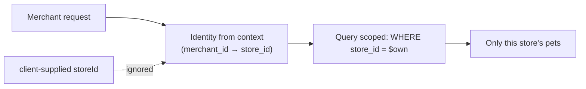

# Security

The security model: who can do what, how identities are proven, what is encrypted and how, and which common attack vectors are addressed. The challenge calls out several explicit security requirements and also expects *implicit* ones ("common web app attack vectors") to be handled — this document is the record of those decisions.

---

## 1. Authentication

All endpoints require **HTTP Basic Authentication** over TLS, as mandated by the challenge.

- Credentials are parsed in middleware, before any resolver runs.
- The supplied email is converted to its **blind index** (HMAC-SHA-256) and looked up; the supplied password is verified against the stored **bcrypt** hash with a constant-time comparison.
- On success the resolved identity (id, role, and — for merchants — store id) is placed in the request `context.Context` under a typed key.
- On failure the request is rejected with an authentication error before any business logic executes.

Credentials and decrypted PII are never logged.

---

## 2. Authorization

### Role separation

There are two roles — **merchant** and **customer** — held in separate tables. A merchant identity can only invoke merchant operations; a customer identity can only invoke customer operations. This is enforced centrally (middleware / a role guard), not re-implemented per resolver, so a missed check cannot silently open a hole.

### Store isolation (multi-tenancy)

A merchant may only access **their own store's** pets.

- The store id is **derived from the authenticated identity**, never accepted as a client argument.
- Every merchant query and mutation is scoped by that store id at the data layer.
- There is no code path where supplying a different `storeId` reaches another store's data. Cross-store access is treated as a defect, not a runtime error to handle.

---

## 3. Encryption

### In transit

TLS terminates at the API (or ingress) for every connection. Local development uses a generated self-signed certificate; clients trust the bundled CA or skip verification for quick testing (see the README). No plaintext traffic is accepted.

### At rest

| Data | Mechanism | Property |
|---|---|---|
| Passwords | bcrypt | One-way; never reversible, never logged. |
| Account & breeder emails, breeder name | AES-256-GCM (authenticated encryption) | Confidential and tamper-evident at rest. |
| Email lookup | HMAC-SHA-256 blind index | Exact-match login lookup without storing or indexing plaintext. |

**Why a blind index:** login needs an exact-match lookup by email, but AES-GCM is non-deterministic (a fresh nonce each time) so the ciphertext can't be searched. Storing an HMAC of the normalized email gives a deterministic, unique, indexable value that reveals nothing without the key — the system can find the account without ever storing the email in the clear. Keys come from configuration/secrets (`PII_ENCRYPTION_KEY`), never the codebase.

---

## 4. Input validation & injection

- Inputs are validated at the boundary (the resolver) before any work runs; invalid requests fail fast with a typed error.
- All SQL is parameterized via sqlc-generated queries — there is no string-built SQL, closing off SQL injection.
- Enumerated inputs (species, status) are constrained by GraphQL enums and database enum types, so out-of-range values are rejected before reaching logic.
- Pet pictures are validated for content type and size before being streamed to object storage.

---

## 5. GraphQL-specific hardening

| Vector | Mitigation |
|---|---|
| Introspection leakage | Introspection disabled outside development. |
| Deeply nested / abusive queries | Query depth and complexity limits. |
| Oversized uploads | Maximum upload size enforced on the picture mutation. |
| Error detail leakage | Resolvers return stable error codes + human messages; internal errors and stack details are never exposed (see [`API.md`](API.md#error-codes)). |
| Batching abuse / N+1 | List queries are keyset-paginated with a bounded page size and a complexity cap; the only per-row resolver (`pictureUrl`) builds a static `/pictures/{key}` path from the stored object key with no database access, so a page of pets triggers no per-row queries. |

---

## 6. Transport, secrets & operational hygiene

- Secrets (DB credentials, encryption keys, MinIO keys, TLS material) are supplied via Kubernetes Secrets in Minikube and via an untracked `.env` locally. None are committed; `.env.example` documents the variables without values.
- Required configuration is validated at startup — the server refuses to boot with a missing key rather than failing later (see [`ARCHITECTURE.md`](ARCHITECTURE.md#8-configuration--startup-fail-fast)).
- Pet pictures are served through the API's `/pictures/{objectKey}` path over TLS rather than exposing the object-storage bucket; clients never receive a signed URL and never reach the bucket or its host directly. The store only serves keys under the `pets/` prefix. The path is unauthenticated because pet pictures are public catalog content addressed by an opaque, unguessable key (see [ADR-0007](adr/0007-picture-proxy-path.md)).

---

## 7. Threat checklist

A quick map from common risks to where they are addressed:

| Risk | Addressed by |
|---|---|
| Broken authentication | Basic auth over TLS, bcrypt, constant-time compare (§1) |
| Broken access control / IDOR across stores | Store id derived from identity, never from input (§2) |
| Privilege confusion (customer ↔ merchant) | Central role separation (§2) |
| SQL injection | Parameterized sqlc queries (§4) |
| Sensitive data exposure at rest | AES-256-GCM + bcrypt + blind index (§3) |
| Sensitive data exposure in transit | TLS everywhere (§3) |
| Secrets in source control | K8s Secrets / untracked `.env` (§6) |
| Denial via expensive queries | Depth/complexity limits, pagination, caching (§5) |
| Race-condition exploits (double purchase) | Atomic conditional writes / locked transactions ([`ARCHITECTURE.md`](ARCHITECTURE.md#4-concurrency--race-condition-strategy)) |
